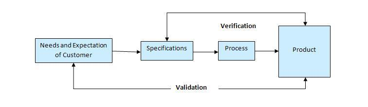

<h1 align="center">Verification and validation

</h1>

1. Verification(kiểm chứng, kiểm định)

- Kiểm định là để chắc chắn sản phẩm được thiết kế để cung cấp tấp cả các chức năng cho khách hàng -> đúng đắn với bản thiết kế -> hướng tới khách hàng
- Kiểm định được thực hiện từ lúc bắt đầu của quá trình phát triển phần mềm. Nó bao gồm các đánh giá và các cuộc họp, rà soát, kiểm tra, ... để đánh giá tài liệu, kế hoạch, việc lập trình, các yêu cầu và các thông số kỹ thuật.
- Việc kiểm định là rất quan trọng, nó diễn ra ở bước khởi đầu của quá trình phát triển phần mềm
- Nó trả lời cho câu hỏi có phải tôi đang xây đựng một sản phẩm đúng không?, có phải tôi đang truy cập đúng dữ liệu không?.

2. Validation(thẩm định)

- Thẩm định là xác định xem hệ thống có phù hợp với yêu cầu và thực hiện các chức năng mà nó được dữ định và đáp ứng các mục tiêu của tổ chức và nhu cầu của người dùng hay không -> có đáp ứng yêu cầu của người dùng không -> testing
- Thẩm định được thực hiện vào cuối giai đoạn phát triển của phầm mềm, diễn ra sau khi việc thẩm định được hoàn thành.
